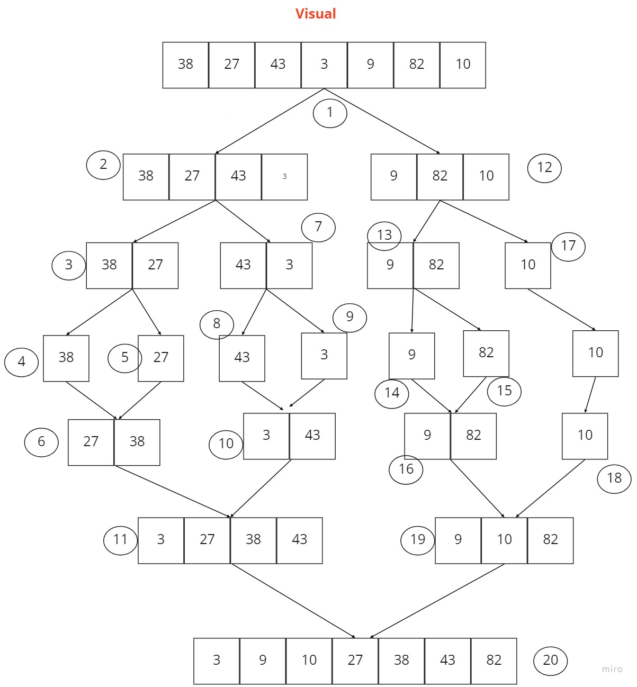

# Merge Sort

Merge Sort is a Divide and Conquer algorithm. It divides the input array into two halves, calls itself for the two halves, and then merges the two sorted halves.

## Problem Domain:
Write a function that implements the Merge sort algorithm, where the input is a list and the output is the sorted list.

## Algorithm
Find the middle point to divide the array into two halves.
Call mergeSort for first half
Call mergeSort for second half.
Merge the two halves sorted

## Pseudo Code:
ALGORITHM Mergesort(arr)
    DECLARE n <-- arr.length
           
    if n > 1
      DECLARE mid <-- n/2
      DECLARE left <-- arr[0...mid]
      DECLARE right <-- arr[mid...n]
      // sort the left side
      Mergesort(left)
      // sort the right side
      Mergesort(right)
      // merge the sorted left and right sides together
      Merge(left, right, arr)

ALGORITHM Merge(left, right, arr)
    DECLARE i <-- 0
    DECLARE j <-- 0
    DECLARE k <-- 0

    while i < left.length && j < right.length
        if left[i] <= right[j]
            arr[k] <-- left[i]
            i <-- i + 1
        else
            arr[k] <-- right[j]
            j <-- j + 1
            
        k <-- k + 1

    if i = left.length
       set remaining entries in arr to remaining values in right
    else
       set remaining entries in arr to remaining values in left

Trace (Visual):
Input: [38, 27, 43, 3, 9, 82, 10]

Time Complexity:

|method|Time|space|
|:--:|:--:|:--|
|marge_sort|O(n log (n))|O(n)|