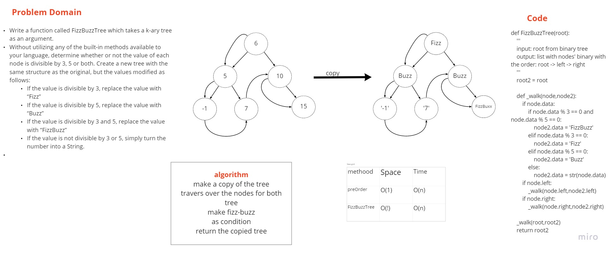

# Trees

Binary Tree and BST Implementation

## Challenge

Write a function called FizzBuzzTree which takes a k-ary tree as an argument.
Without utilizing any of the built-in methods available to your language, determine whether or not the value of each node is divisible by 3, 5 or both. Create a new tree with the same structure as the original, but the values modified as follows:
If the value is divisible by 3, replace the value with “Fizz”
If the value is divisible by 5, replace the value with “Buzz”
If the value is divisible by 3 and 5, replace the value with “FizzBuzz”
If the value is not divisible by 3 or 5, simply turn the number into a String.

## Approach & Efficiency

using recursion

## API

| Method | Time | Space |
| :----------- | :----------- | :----------- |
| preOrder |O(n) | O(1) |
| FizzBuzzTree |O(n) | O(1) |

[PR link _ FizzBuzzTree](https://github.com/fadiHB/data-structures-and-algorithms-python-401d2/pull/23)
it tooks 1 hour

