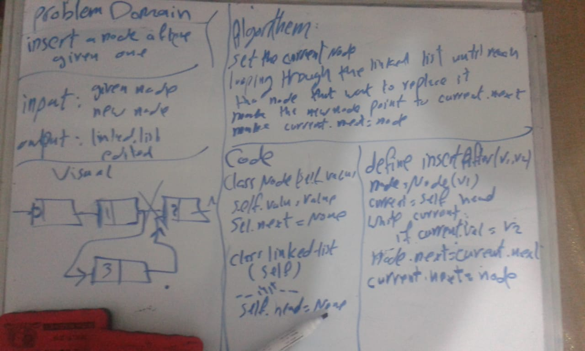
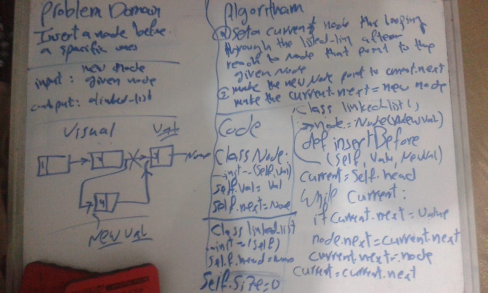
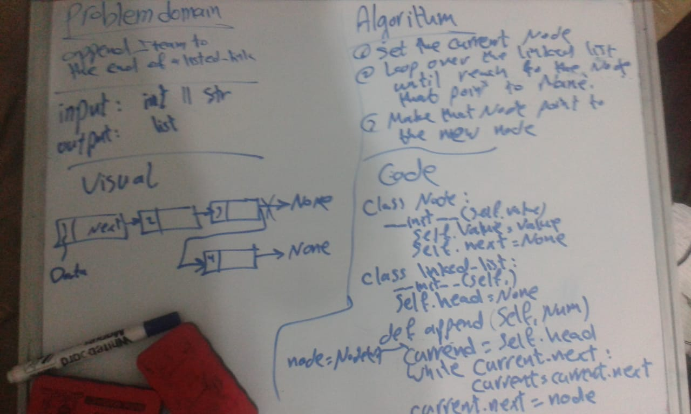

# Singly Linked List

Linked List
In computer science, a linked list is a linear collection of data elements whose order is not given by their physical placement in memory. Instead, each element points to the next. It is a data structure consisting of a collection of nodes which together represent a sequence

## Challenge

append ,insertAfter ,insertBefor.
we should define these three methood usning Linked-List

## Approach & Efficiency

it took about 6 h

## API

PR link : https://github.com/fadiHB/data-structures-and-algorithms-python-401d2/pull/6

