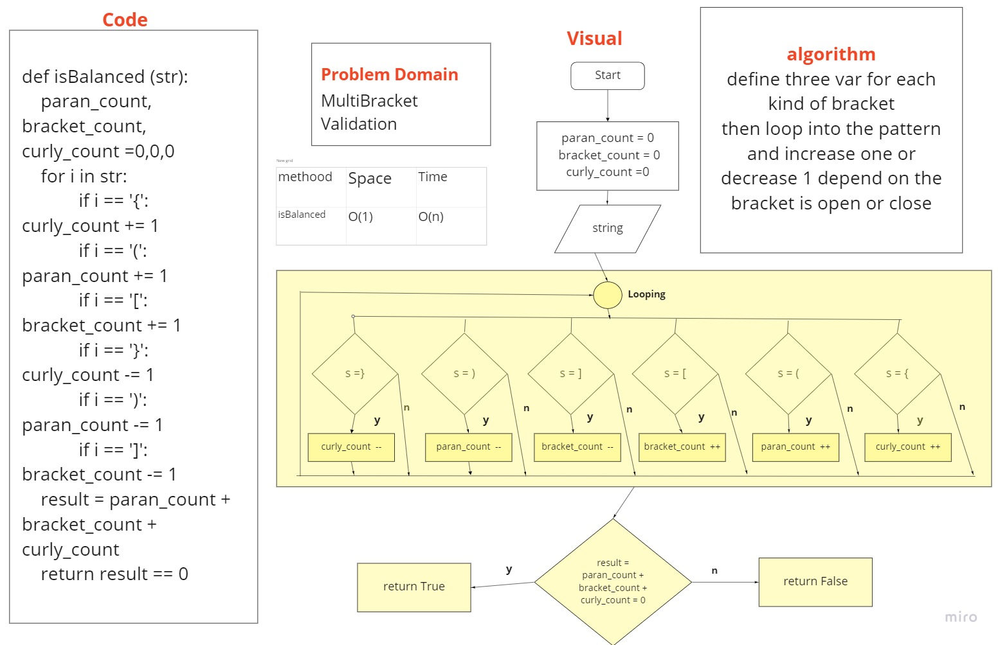

# Challenge Summary

Stacks and Queue

## Challenge Description

Your function should take a string as its only argument, and should return a boolean representing whether or not the brackets in the string are balanced.

## Approach & Efficiency

| Method | Time | Space |
| :----------- | :----------- | :----------- |
| isBalanced | O(n) | O(1) |

## Solution

 it took 1 hour

[PR link]()
