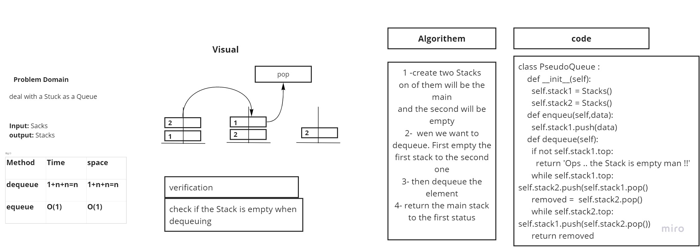

# Challenge Summary

Stacks and Queue

## Challenge Description

Create a brand new PseudoQueue class. Do not use an existing Queue. Instead, this PseudoQueue class will implement our standard queue interface (the two methods listed below), but will internally only utilize 2 Stack objects. Ensure that you create your class with the following methods

## Approach & Efficiency

| Method | Time | Space |
| :----------- | :----------- | :----------- |
| Enqueue | O(1) | O(1) |
| Dequeue | O(n) | O(n) |
p.s: there is an error in the image

## Solution

 it took 15 min ( after understadnig whtat exactly the challenge is)

