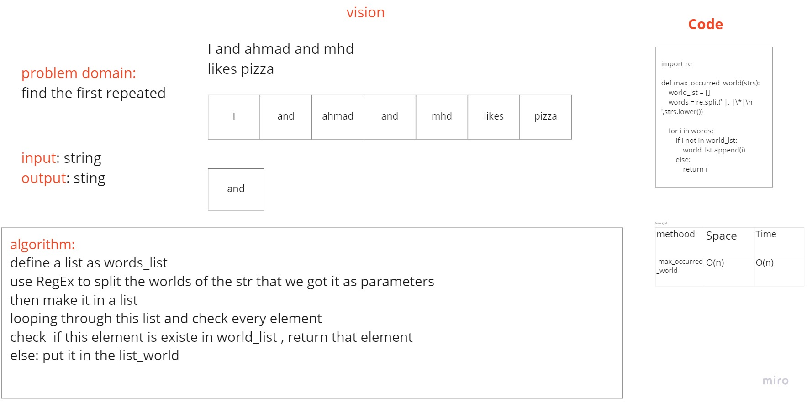

# Challenge Summary

return the first repeted word

## Challenge Description

Write a function that accepts a lengthy string parameter.
Without utilizing any of the built-in library methods available to your language, return the first word to occur more than once in that provided string.

## Approach & Efficiency

| Method | Time | Space |
| :----------- | :----------- | :----------- |
| max_occurred_world | O(n) | O(1) |

## Solution

