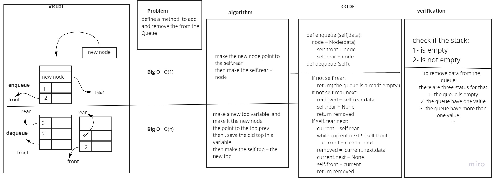
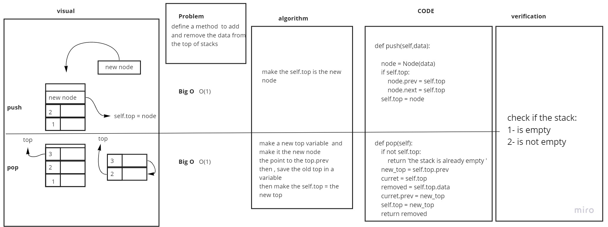

# Stacks and Queues
the basic of Stacks and Queues

## Challenge
pop,push
dequeue,enqueu

## Approach & Efficiency
<!-- What approach did you take? Why? What is the Big O space/time for this approach? -->
Big O (1) for enqueu , pop and push
Big O (n) for dequeu

## API
<!-- Description of each method publicly available to your Stack and Queue-->

PR LINK: