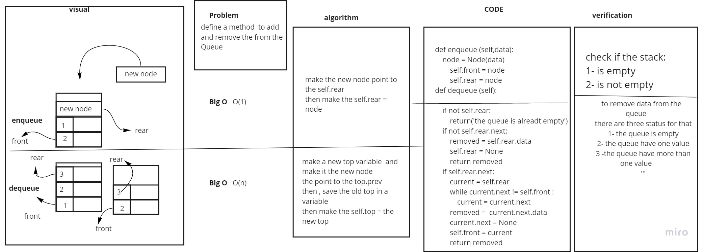
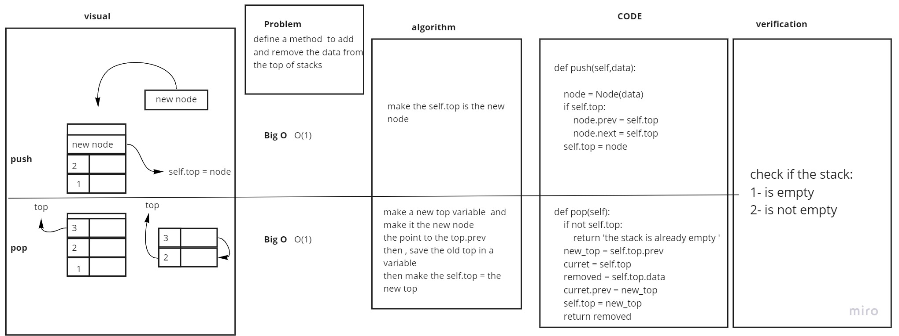

# Stacks and Queues
the basic of Stacks and Queues

## Challenge
pop,push
dequeue,enqueue

## Approach & Efficiency
<!-- What approach did you take? Why? What is the Big O space/time for this approach? -->
Big O (1) for enqueue , pop and push
Big O (n) for dequeue

## API
<!-- Description of each method publicly available to your Stack and Queue-->

PR LINK:https://github.com/fadiHB/data-structures-and-algorithms-python-401d2/pull/9
