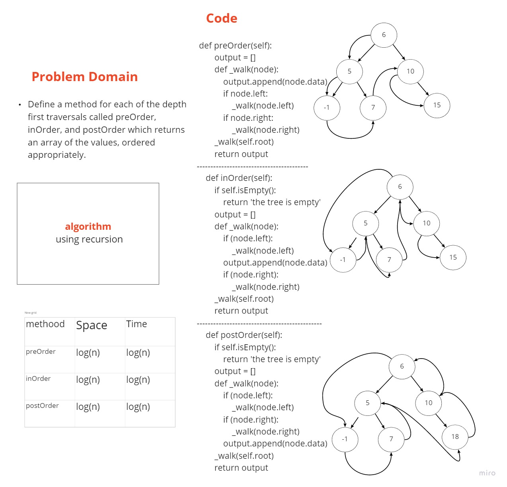
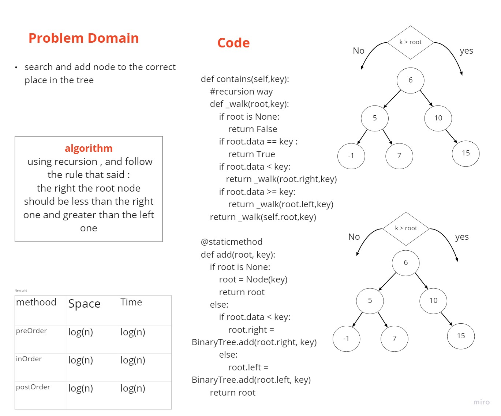
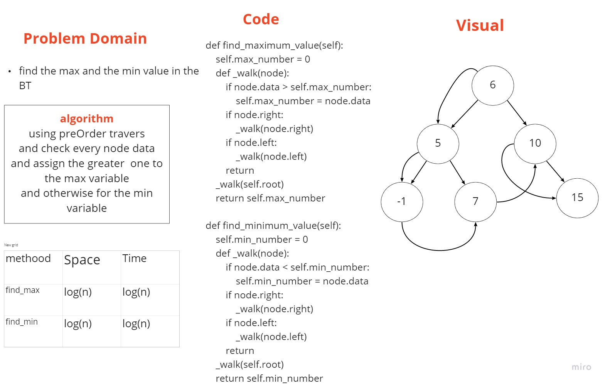
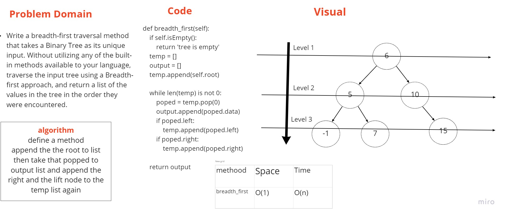

# Trees

Binary Tree and BST Implementation

## Challenge

Define a method for each of the depth first traversals called preOrder, inOrder, and postOrder which returns an array of the values, ordered appropriately.

Create a BinarySearchTree class
Define a method named add that accepts a value, and adds a new node with that value in the correct location in the binary search tree.
Define a method named contains that accepts a value, and returns a boolean indicating whether or not the value is in the tree at least once.

Write an instance method called find-maximum-value. Without utilizing any of the built-in methods available to your language, return the maximum value stored in the tree.

Write an instance method called find-minimum-value. Without utilizing any of the built-in methods available to your language, return the minimum value stored in the tree.

Write a breadth first traversal method which takes a Binary Tree as its unique input. Without utilizing any of the built-in methods available to your language, traverse the input tree using a Breadth-first approach, and return a list of the values in the tree in the order they were encountered

## Approach & Efficiency

using recursion

## API

| Method | Time | Space |
| :----------- | :----------- | :----------- |
| preOrder |O(n) | O(1) |
| inOrder |O(n) | O(1) |
| postOrder |O(n) | O(1) |
| add |log(n) | O(1) |
| contains |log(n) | O(1) |
| find_maximum_value |O(n) | O(1) |
| find_minimum_value |O(n) | O(1) |
| breadth_first |O(n) | O(1) |

[PR link _ traversals](https://github.com/fadiHB/data-structures-and-algorithms-python-401d2/pull/20)
it tooks 6 hours

[PR link _ find_max_min](https://github.com/fadiHB/data-structures-and-algorithms-python-401d2/pull/21)
it tooks 30 min

[PR link _ breadth_first](https://github.com/fadiHB/data-structures-and-algorithms-python-401d2/pull/22)
it tooks 1 hour

