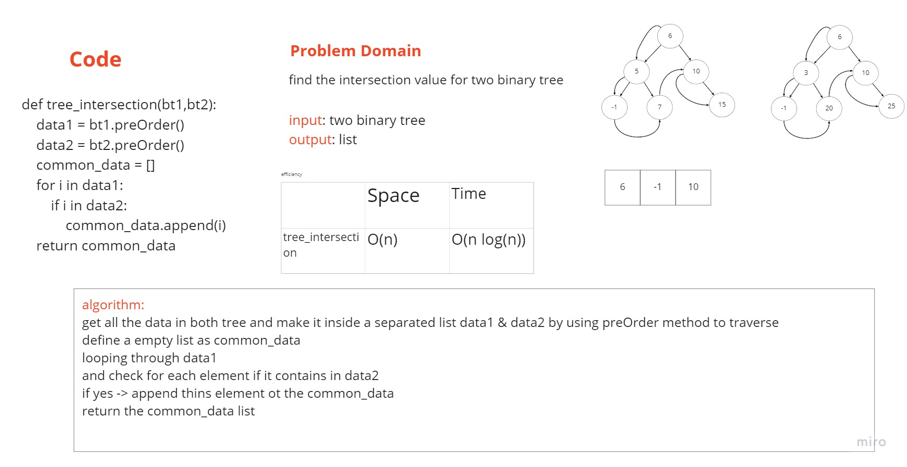

# Challenge Summary
find the intersection of two bt

## Challenge Description
Write a function called tree_intersection that takes two binary tree parameters.
Without utilizing any of the built-in library methods available to your language, return a set of values found in both trees.

## Approach & Efficiency
| Method | Time | Space |
| :----------- | :----------- | :----------- |
| preOrder |O(n) | O(1) |
| tree_intersection |O(n) | O(n) |

## Solution

